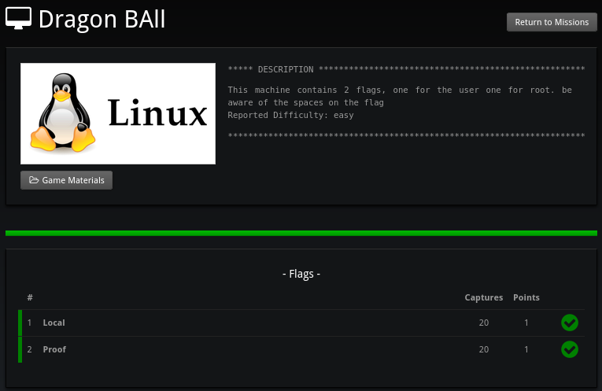
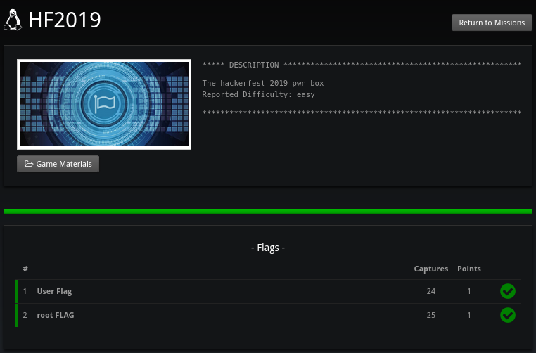

# CEH CTFs ISEP Academy

Instructions and notes on how I achieved each flag during my study in ISEP Academy to obtain my Certified Ethical Hacker (CEH) certification

## Results

### Fun With Flags

**Notes:**
[📘 Open the Fun With Flags instructions](./1-fun-with-flags/fun-with-notes.md)

**Result:**

### Dragon Ball

**Notes:**
[📘 Open the Dragon Ball instructions](./2-dragon-ball/dragon-ball.md)

**Result:**

### Hackerfest 2019

**Notes:**
[📘 Open the HF 2019 instructions](./3-hf-2019/hf-2019,md)

**Result:**

